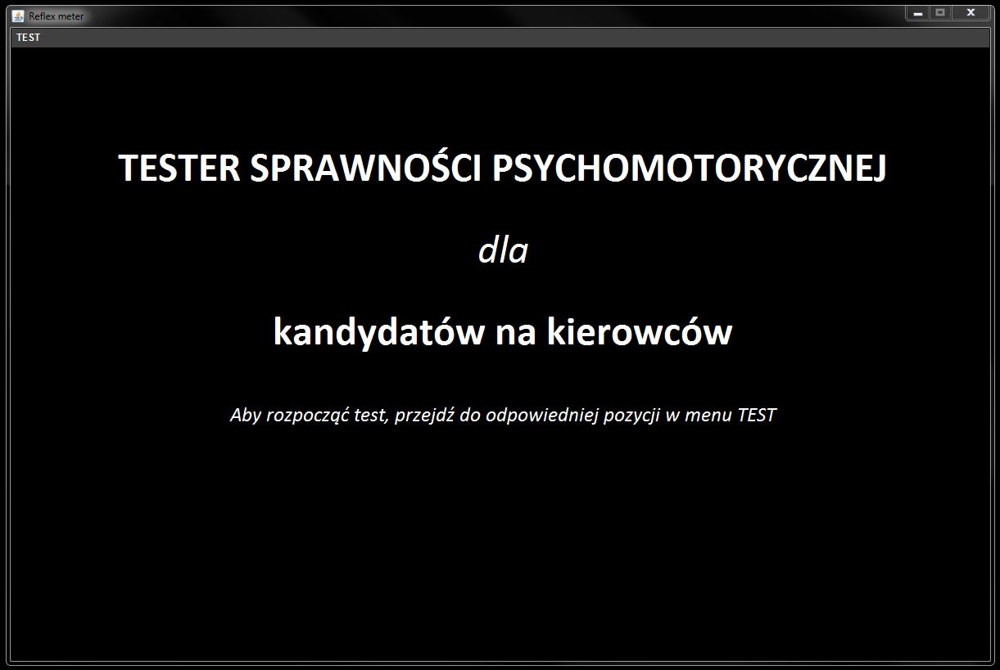
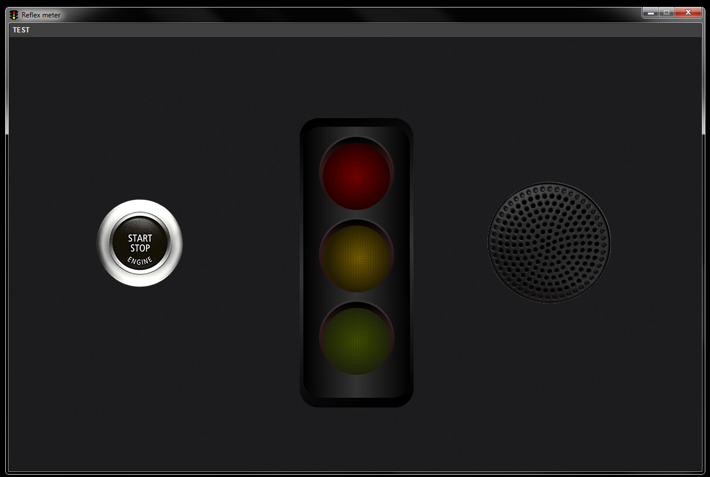
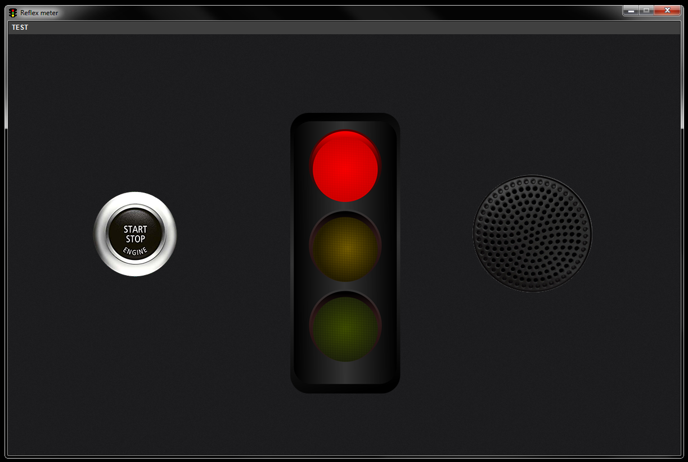
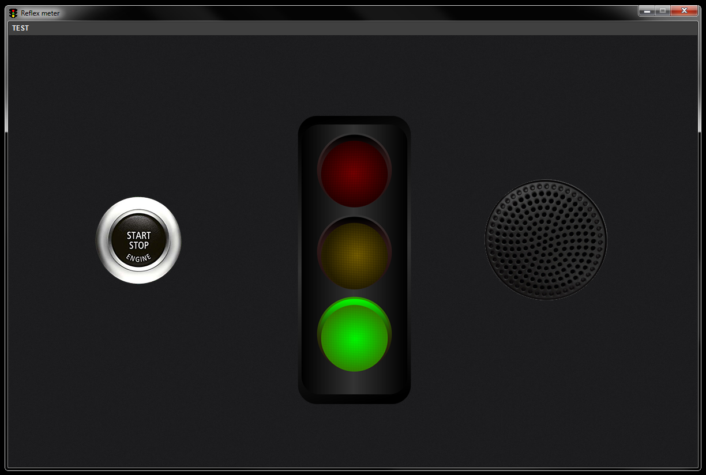
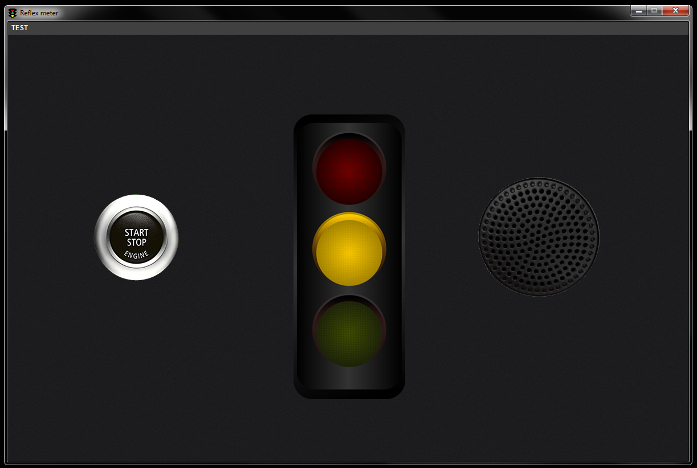
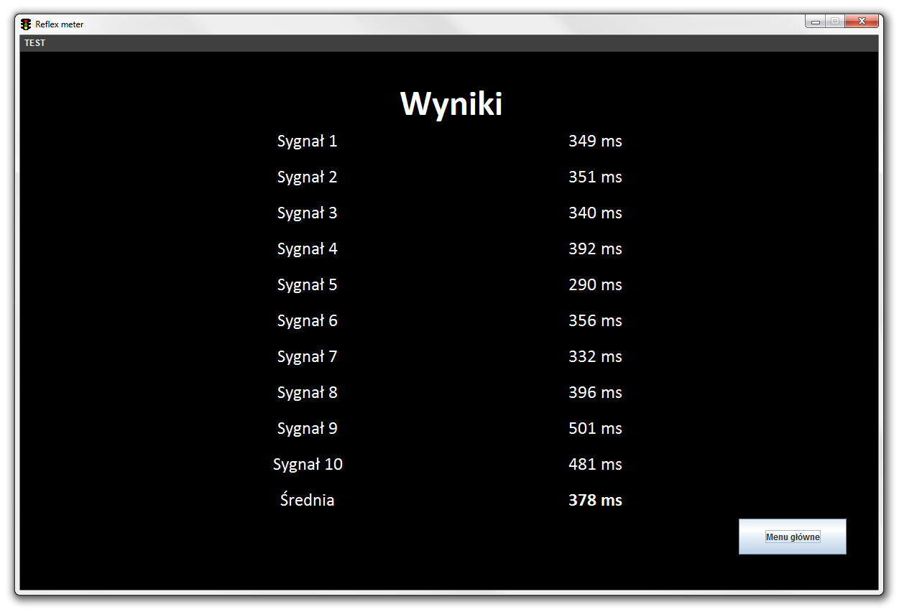

# Reflex meter

![Language][language-url] ![License][license-url] ![Version][version-url] ![Done][done-url] ![Maintenance][maintenance-url]

### Application for measuring reflex times, f.e. for professional driver candidates.

##### This project was developed for *The fundamentals of organization of computer systems* classes at Electronics, Telecommunications and Informatics faculty of Gdańsk University of Technology.

## How it works

Application is intended as psychomotor test for candidates for professional drivers. User can do two tests: simple or complex.

In simple test all signals (red, yellow and green light and sound) are emitted 10 times. User needs to react for every signal by clicking visible button.

In complex test signals are the same as in simple test. The difference is that user needs to react for every signal in different manner:

- Red light - clicking the button with left mouse button
- Green light - clicking with right mouse button
- Yellow light - no reaction (do nothing)
- Sound signal - pressing *Space* button

After 10 signals results are displayed with reaction times.

## Screenshots

  
  

## Disadvantages

Almost all code is written in Polish language which is very bad practice. Take a note that this project was developed only for studies purposes at initial semesters. 

[language-url]: https://img.shields.io/badge/language-Java-lightgrey.svg?style=flat "Language"
[license-url]: https://img.shields.io/badge/license-MIT-blue.svg?style=flat "License"
[version-url]: https://img.shields.io/badge/version-1.0.0-brightgreen.svg?style=flat "Version"
[done-url]: https://img.shields.io/badge/done-11.2014-yellow.svg?style=flat "Done"
[maintenance-url]: https://img.shields.io/maintenance/no/2014.svg?style=flat "Maintenance"
